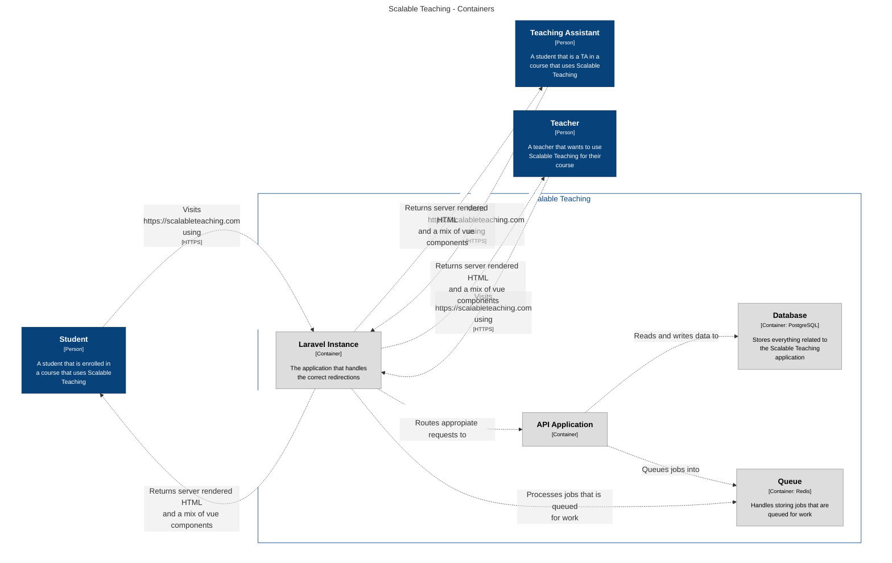

```mermaid
graph TB
  linkStyle default fill:#ffffff

  subgraph diagram ["Scalable Teaching - Containers"]
    style diagram fill:#ffffff,stroke:#ffffff

    1["<div style='font-weight: bold'>Student</div><div style='font-size: 70%; margin-top: 0px'>[Person]</div><div style='font-size: 80%; margin-top:10px'>A student that is enrolled in<br />a course that uses Scalable<br />Teaching</div>"]
    style 1 fill:#08427b,stroke:#052e56,color:#ffffff
    2["<div style='font-weight: bold'>Teaching Assistant</div><div style='font-size: 70%; margin-top: 0px'>[Person]</div><div style='font-size: 80%; margin-top:10px'>A student that is a TA in a<br />course that uses Scalable<br />Teaching</div>"]
    style 2 fill:#08427b,stroke:#052e56,color:#ffffff
    3["<div style='font-weight: bold'>Teacher</div><div style='font-size: 70%; margin-top: 0px'>[Person]</div><div style='font-size: 80%; margin-top:10px'>A teacher that wants to use<br />Scalable Teaching for their<br />course</div>"]
    style 3 fill:#08427b,stroke:#052e56,color:#ffffff

    subgraph 4 [Scalable Teaching]
      style 4 fill:#ffffff,stroke:#0b4884,color:#0b4884

      5["<div style='font-weight: bold'>Laravel Instance</div><div style='font-size: 70%; margin-top: 0px'>[Container]</div><div style='font-size: 80%; margin-top:10px'>The application that handles<br />the correct redirections</div>"]
      style 5 fill:#dddddd,stroke:#9a9a9a,color:#000000
      6["<div style='font-weight: bold'>API Application</div><div style='font-size: 70%; margin-top: 0px'>[Container]</div>"]
      style 6 fill:#dddddd,stroke:#9a9a9a,color:#000000
      7["<div style='font-weight: bold'>Database</div><div style='font-size: 70%; margin-top: 0px'>[Container: PostgreSQL]</div><div style='font-size: 80%; margin-top:10px'>Stores everything related to<br />the Scalable Teaching<br />application</div>"]
      style 7 fill:#dddddd,stroke:#9a9a9a,color:#000000
      8["<div style='font-weight: bold'>Queue</div><div style='font-size: 70%; margin-top: 0px'>[Container: Redis]</div><div style='font-size: 80%; margin-top:10px'>Handles storing jobs that are<br />queued for work</div>"]
      style 8 fill:#dddddd,stroke:#9a9a9a,color:#000000
    end

    5-. "<div>Routes appropiate requests to</div><div style='font-size: 70%'></div>" .->6
    6-. "<div>Reads and writes data to</div><div style='font-size: 70%'></div>" .->7
    6-. "<div>Queues jobs into</div><div style='font-size: 70%'></div>" .->8
    5-. "<div>Processes jobs that is queued<br />for work</div><div style='font-size: 70%'></div>" .->8
    1-. "<div>Visits<br />https://scalableteaching.com<br />using</div><div style='font-size: 70%'>[HTTPS]</div>" .->5
    5-. "<div>Returns server rendered HTML<br />and a mix of vue components</div><div style='font-size: 70%'></div>" .->1
    3-. "<div>Visits<br />https://scalableteaching.com<br />using</div><div style='font-size: 70%'>[HTTPS]</div>" .->5
    5-. "<div>Returns server rendered HTML<br />and a mix of vue components</div><div style='font-size: 70%'></div>" .->3
    2-. "<div>Visits<br />https://scalableteaching.com<br />using</div><div style='font-size: 70%'>[HTTPS]</div>" .->5
    5-. "<div>Returns server rendered HTML<br />and a mix of vue components</div><div style='font-size: 70%'></div>" .->2
  end
```
