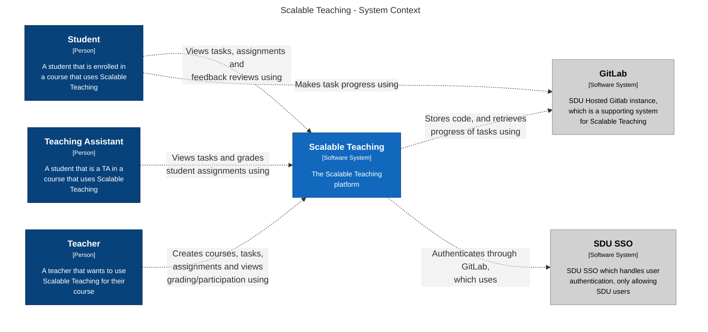

```mermaid
graph TB
  linkStyle default fill:#ffffff

  subgraph diagram ["Scalable Teaching - System Context"]
    style diagram fill:#ffffff,stroke:#ffffff

    1["<div style='font-weight: bold'>Student</div><div style='font-size: 70%; margin-top: 0px'>[Person]</div><div style='font-size: 80%; margin-top:10px'>A student that is enrolled in<br />a course that uses Scalable<br />Teaching</div>"]
    style 1 fill:#08427b,stroke:#052e56,color:#ffffff
    2["<div style='font-weight: bold'>Teaching Assistant</div><div style='font-size: 70%; margin-top: 0px'>[Person]</div><div style='font-size: 80%; margin-top:10px'>A student that is a TA in a<br />course that uses Scalable<br />Teaching</div>"]
    style 2 fill:#08427b,stroke:#052e56,color:#ffffff
    3["<div style='font-weight: bold'>Teacher</div><div style='font-size: 70%; margin-top: 0px'>[Person]</div><div style='font-size: 80%; margin-top:10px'>A teacher that wants to use<br />Scalable Teaching for their<br />course</div>"]
    style 3 fill:#08427b,stroke:#052e56,color:#ffffff
    4["<div style='font-weight: bold'>Scalable Teaching</div><div style='font-size: 70%; margin-top: 0px'>[Software System]</div><div style='font-size: 80%; margin-top:10px'>The Scalable Teaching<br />platform</div>"]
    style 4 fill:#1168bd,stroke:#0b4884,color:#ffffff
    5["<div style='font-weight: bold'>GitLab</div><div style='font-size: 70%; margin-top: 0px'>[Software System]</div><div style='font-size: 80%; margin-top:10px'>SDU Hosted Gitlab instance,<br />which is a supporting system<br />for Scalable Teaching</div>"]
    style 5 fill:#d1d1d1,stroke:#929292,color:#000000
    6["<div style='font-weight: bold'>SDU SSO</div><div style='font-size: 70%; margin-top: 0px'>[Software System]</div><div style='font-size: 80%; margin-top:10px'>SDU SSO which handles user<br />authentication, only allowing<br />SDU users</div>"]
    style 6 fill:#d1d1d1,stroke:#929292,color:#000000

    2-. "<div>Views tasks and grades<br />student assignments using</div><div style='font-size: 70%'></div>" .->4
    4-. "<div>Stores code, and retrieves<br />progress of tasks using</div><div style='font-size: 70%'></div>" .->5
    4-. "<div>Authenticates through GitLab,<br />which uses</div><div style='font-size: 70%'></div>" .->6
    1-. "<div>Views tasks, assignments and<br />feedback reviews using</div><div style='font-size: 70%'></div>" .->4
    1-. "<div>Makes task progress using</div><div style='font-size: 70%'></div>" .->5
    3-. "<div>Creates courses, tasks,<br />assignments and views<br />grading/participation using</div><div style='font-size: 70%'></div>" .->4
  end
```
